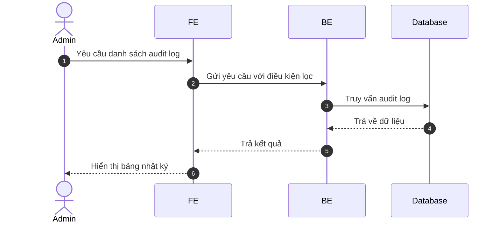
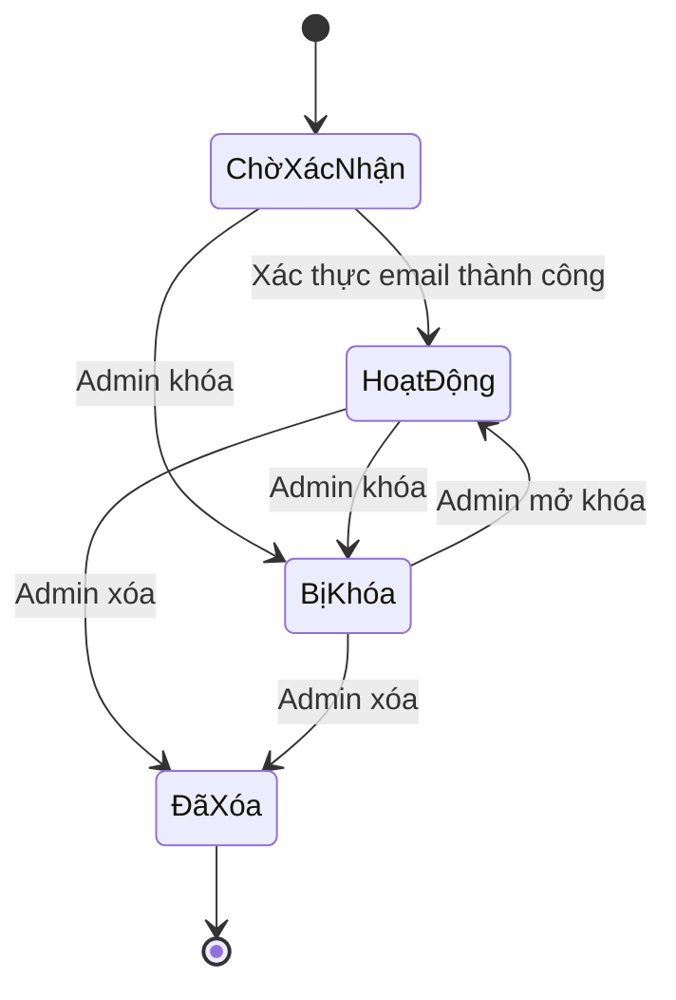
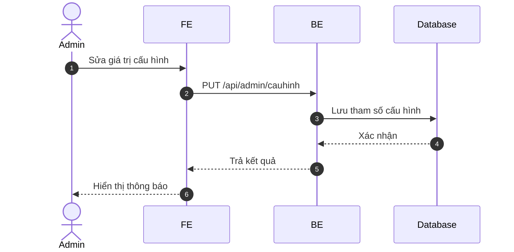
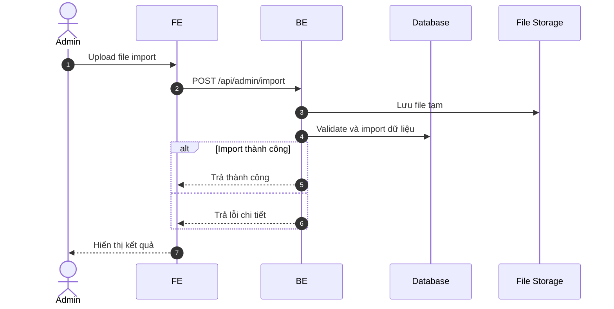
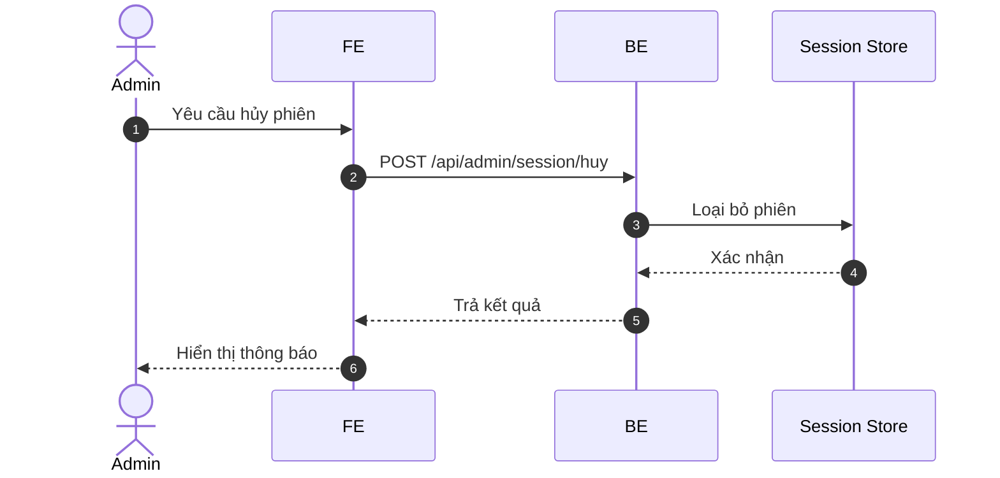
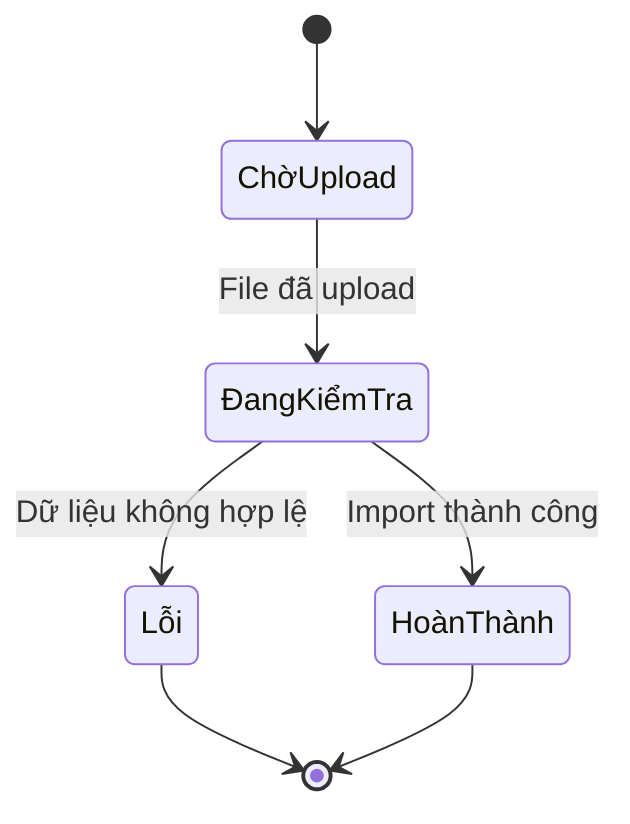
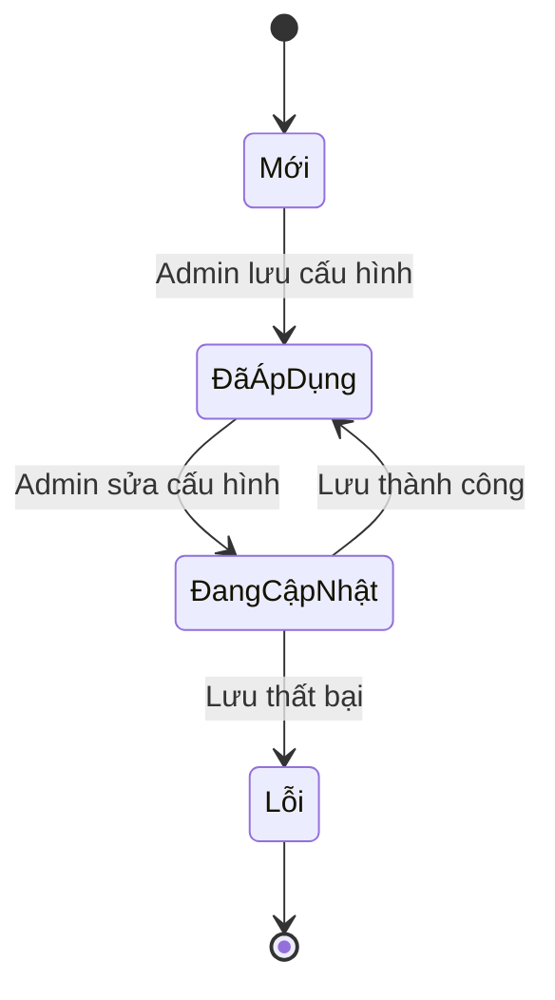

# Cấu trúc Hệ thống Quản lý Tài chính Cá nhân - Phân hệ Quản trị

Tài liệu này mô tả chi tiết các chức năng, biểu đồ và VOPC của phân hệ Admin.

---

## 1. Phân hệ Quản trị (Admin)

Phân hệ Admin phục vụ quản lý nội bộ, giám sát toàn hệ thống và quản lý dữ liệu chung.

### 1.1. Các chức năng chính của Admin

- **Quản lý người dùng**
  + Xem danh sách người dùng, chi tiết, trạng thái.
  + Khóa/mở khóa tài khoản, xóa tài khoản.

- **Giám sát Audit Log**
  + Xem lịch sử hành động người dùng và hệ thống.
  + Lọc theo thời gian, hành động, người thực hiện.

- **Quản lý phiên**
  + Xem và hủy các phiên đăng nhập đang hoạt động.

- **Cấu hình hệ thống**
  + Điều chỉnh tham số backend, dung lượng upload, timeout, AI.

- **Quản lý danh mục chung**
  + Thiết lập danh mục mặc định cho người dùng.
  + Quản lý icon, nhóm danh mục.

- **Quản lý tỷ giá / tiền tệ**
  + Cập nhật các loại tiền tệ và tỷ giá quy đổi.

- **Giám sát import**
  + Xem tiến trình import file, xử lý lỗi dữ liệu.

- **Quản lý AI / Gemini**
  + Cấu hình và điều chỉnh tham số AI.

### 1.2. Use Case Diagram (Admin)

```mermaid
useCaseDiagram
    actor "Quản trị viên" as A
    
    package "Admin" {
        usecase "Quản lý người dùng" as AD1
        usecase "Xem audit log" as AD2
        usecase "Quản lý phiên" as AD3
        usecase "Cấu hình hệ thống" as AD4
        usecase "Quản lý danh mục" as AD5
        usecase "Quản lý tỷ giá" as AD6
        usecase "Giám sát import" as AD7
        usecase "Quản lý AI" as AD8
    }
    
    A --> AD1
    A --> AD2
    A --> AD3
    A --> AD4
    A --> AD5
    A --> AD6
    A --> AD7
    A --> AD8
```

### 1.3. Activity Diagram - Khóa tài khoản người dùng

```mermaid
activityDiagram
    start
    :Admin mở trang quản lý người dùng;
    :Chọn người dùng cần xử lý;
    :Click Khóa tài khoản;
    :Xác nhận thao tác;
    :Hệ thống cập nhật trạng thái tài khoản;
    :Hủy session hiện tại của user;
    :Ghi log vào audit;
    :Hiển thị thông báo thành công;
    stop
```

### 1.4. Sequence Diagram - Truy vấn Audit Log



### 1.5. State Machine Diagram - Trạng thái tài khoản người dùng



### 1.6. Use Case chi tiết cho Admin

```mermaid
useCaseDiagram
    actor "Quản trị viên" as A
    
    package "Người dùng" {
        usecase "Xem danh sách user" as AD1
        usecase "Khóa/mở khóa user" as AD2
        usecase "Xóa user" as AD3
    }
    package "Hệ thống" {
        usecase "Cấu hình tham số" as AD4
        usecase "Quản lý phiên" as AD5
        usecase "Giám sát import" as AD6
        usecase "Cấu hình AI" as AD7
    }
    package "Audit" {
        usecase "Xem audit log" as AD8
        usecase "Tìm kiếm audit" as AD9
    }
    A --> AD1
    A --> AD2
    A --> AD3
    A --> AD4
    A --> AD5
    A --> AD6
    A --> AD7
    A --> AD8
    A --> AD9
```

### 1.7. Activity Diagram cho các chức năng con Admin

#### 1.7.1. Import dữ liệu

```mermaid
activityDiagram
    start
    :Admin vào trang Import;
    :Upload file dữ liệu;
    :BE kiểm tra định dạng và validate;
    if (Dữ liệu hợp lệ?) then (Có)
        :Nhập dữ liệu vào DB;
        :Hiển thị kết quả import thành công;
    else (Không)
        :Ghi lỗi và trả về chi tiết;
        :Hiển thị lỗi cho admin;
    endif
    stop
```

#### 1.7.2. Cập nhật cấu hình hệ thống

```mermaid
activityDiagram
    start
    :Admin vào trang Cấu hình;
    :Sửa giá trị tham số;
    :Nhấn Lưu;
    :BE kiểm tra và lưu cấu hình;
    :Hiển thị thông báo thành công;
    stop
```

#### 1.7.3. Hủy phiên người dùng

```mermaid
activityDiagram
    start
    :Admin mở trang Phiên;
    :Chọn phiên cần hủy;
    :Xác nhận thao tác;
    :BE hủy phiên trên DB/cache;
    :Thông báo đã hủy phiên;
    stop
```

### 1.8. Sequence Diagram cho các chức năng con Admin

#### 1.8.1. Cập nhật cấu hình hệ thống



#### 1.8.2. Import dữ liệu



#### 1.8.3. Hủy phiên người dùng



### 1.9. State Machine Diagram cho các đối tượng Admin

#### 1.9.1. Trạng thái Import



#### 1.9.2. Trạng thái Cấu hình hệ thống



---

## 2. VOPC cho Use Case của Admin

### 2.1. VOPC cho Use Case chính của Admin (từ 2.2)

#### AD1: Quản lý người dùng
- **Actor:** Admin
- **Pre-conditions:** Admin đã đăng nhập
- **Post-conditions:** User được quản lý
- **Main Flow:** Xem danh sách → Thao tác → Lưu
- **Alternative Flows:** Tìm kiếm, lọc
- **Exception Flows:** Quyền không đủ
- **Business Rules:** Admin có quyền cao nhất
- **Non-functional Requirements:** Bảo mật cao

#### AD2: Xem audit log
- **Actor:** Admin
- **Pre-conditions:** Có dữ liệu log
- **Post-conditions:** Log hiển thị
- **Main Flow:** Chọn bộ lọc → Xem
- **Alternative Flows:** Xuất log
- **Exception Flows:** Không có dữ liệu
- **Business Rules:** Log không thể sửa
- **Non-functional Requirements:** Tìm kiếm nhanh

#### AD3: Quản lý phiên
- **Actor:** Admin
- **Pre-conditions:** Có phiên hoạt động
- **Post-conditions:** Phiên được hủy
- **Main Flow:** Chọn phiên → Hủy
- **Alternative Flows:** Không có
- **Exception Flows:** Phiên không tồn tại
- **Business Rules:** Chỉ hủy phiên bất thường
- **Non-functional Requirements:** Hủy tức thì

#### AD4: Cấu hình hệ thống
- **Actor:** Admin
- **Pre-conditions:** Quyền cấu hình
- **Post-conditions:** Cấu hình cập nhật
- **Main Flow:** Sửa tham số → Lưu
- **Alternative Flows:** Khôi phục mặc định
- **Exception Flows:** Giá trị không hợp lệ
- **Business Rules:** Tham số trong phạm vi cho phép
- **Non-functional Requirements:** Áp dụng ngay

#### AD5: Quản lý danh mục
- **Actor:** Admin
- **Pre-conditions:** Quyền quản lý
- **Post-conditions:** Danh mục hệ thống cập nhật
- **Main Flow:** CRUD danh mục → Lưu
- **Alternative Flows:** Không có
- **Exception Flows:** Danh mục đang dùng
- **Business Rules:** Danh mục hệ thống không xóa
- **Non-functional Requirements:** Đồng bộ cho tất cả user

#### AD6: Quản lý tỷ giá
- **Actor:** Admin
- **Pre-conditions:** Hỗ trợ đa tiền tệ
- **Post-conditions:** Tỷ giá cập nhật
- **Main Flow:** Nhập tỷ giá → Lưu
- **Alternative Flows:** Tự động cập nhật
- **Exception Flows:** Tỷ giá âm
- **Business Rules:** Tỷ giá >0
- **Non-functional Requirements:** Cập nhật real-time

#### AD7: Giám sát import
- **Actor:** Admin
- **Pre-conditions:** File upload
- **Post-conditions:** Dữ liệu import
- **Main Flow:** Upload → Validate → Import
- **Alternative Flows:** Hủy import
- **Exception Flows:** Dữ liệu lỗi
- **Business Rules:** Validate chặt chẽ
- **Non-functional Requirements:** Báo cáo lỗi chi tiết

#### AD8: Quản lý AI
- **Actor:** Admin
- **Pre-conditions:** Quyền cấu hình AI
- **Post-conditions:** AI cấu hình
- **Main Flow:** Sửa tham số → Lưu
- **Alternative Flows:** Test AI
- **Exception Flows:** Tham số không hợp lệ
- **Business Rules:** Giới hạn sử dụng AI
- **Non-functional Requirements:** Giám sát usage

### 2.2. VOPC cho Use Case con của Admin (từ 2.6)

#### AD1: Xem danh sách user
- **Actor:** Admin
- **Pre-conditions:** Quyền xem
- **Post-conditions:** Danh sách hiển thị
- **Main Flow:** Truy cập → Xem
- **Alternative Flows:** Phân trang
- **Exception Flows:** Không có quyền
- **Business Rules:** Chỉ xem thông tin cần thiết
- **Non-functional Requirements:** Tải nhanh

#### AD2: Khóa/mở khóa user
- **Actor:** Admin
- **Pre-conditions:** User tồn tại
- **Post-conditions:** Trạng thái thay đổi
- **Main Flow:** Chọn user → Thao tác → Lưu
- **Alternative Flows:** Không có
- **Exception Flows:** User không tồn tại
- **Business Rules:** Ghi log hành động
- **Non-functional Requirements:** Hủy session ngay

#### AD3: Xóa user
- **Actor:** Admin
- **Pre-conditions:** User không hoạt động
- **Post-conditions:** User xóa
- **Main Flow:** Xác nhận → Xóa
- **Alternative Flows:** Không có
- **Exception Flows:** User có dữ liệu
- **Business Rules:** Backup trước khi xóa
- **Non-functional Requirements:** Xóa vĩnh viễn

#### AD4: Cấu hình tham số
- **Actor:** Admin
- **Pre-conditions:** Quyền cấu hình
- **Post-conditions:** Tham số lưu
- **Main Flow:** Sửa → Lưu
- **Alternative Flows:** Reset
- **Exception Flows:** Giá trị ngoài phạm vi
- **Business Rules:** Validate chặt
- **Non-functional Requirements:** Áp dụng tức thì

#### AD5: Quản lý phiên
- **Actor:** Admin
- **Pre-conditions:** Có phiên
- **Post-conditions:** Phiên hủy
- **Main Flow:** Chọn → Hủy
- **Alternative Flows:** Không có
- **Exception Flows:** Phiên hết hạn
- **Business Rules:** Chỉ hủy phiên bất thường
- **Non-functional Requirements:** Bảo mật

#### AD6: Giám sát import
- **Actor:** Admin
- **Pre-conditions:** File upload
- **Post-conditions:** Import xong
- **Main Flow:** Upload → Giám sát
- **Alternative Flows:** Dừng import
- **Exception Flows:** Lỗi dữ liệu
- **Business Rules:** Rollback nếu lỗi
- **Non-functional Requirements:** Báo cáo tiến độ

#### AD7: Cấu hình AI
- **Actor:** Admin
- **Pre-conditions:** Quyền AI
- **Post-conditions:** AI cấu hình
- **Main Flow:** Sửa → Lưu
- **Alternative Flows:** Test
- **Exception Flows:** Tham số sai
- **Business Rules:** Giới hạn API call
- **Non-functional Requirements:** Giám sát

#### AD8: Xem audit log
- **Actor:** Admin
- **Pre-conditions:** Có log
- **Post-conditions:** Log hiển thị
- **Main Flow:** Lọc → Xem
- **Alternative Flows:** Xuất
- **Exception Flows:** Không có dữ liệu
- **Business Rules:** Log immutable
- **Non-functional Requirements:** Tìm kiếm hiệu quả

#### AD9: Tìm kiếm audit
- **Actor:** Admin
- **Pre-conditions:** Có log
- **Post-conditions:** Kết quả tìm
- **Main Flow:** Nhập từ khóa → Tìm
- **Alternative Flows:** Lọc nâng cao
- **Exception Flows:** Không tìm thấy
- **Business Rules:** Tìm theo nhiều tiêu chí
- **Non-functional Requirements:** Tìm nhanh
        usecase "Đăng xuất tài khoản cưỡng chế" as UC_Kick
    }
    
    A --> UC_Audit
    A --> UC_Error
    A --> UC_Session
    A --> UC_Kick
```

### 2.2. Phân tích chức năng chi tiết
- **Audit Log:** Theo dõi các hành động nhạy cảm (Xóa dữ liệu, sửa số dư). Lưu trữ thông tin: *Ai làm - Làm gì - Lúc nào - Kết quả ra sao*.
- **Quản lý Phiên (Session):** Xem có bao nhiêu máy đang đăng nhập vào cùng một tài khoản, địa chỉ IP và trình duyệt tương ứng.
- **Theo dõi lỗi:** Tập trung các thống kê lỗi từ Backend để kỹ thuật viên kịp thời xử lý.

---

## 3. Phân hệ Cấu hình Quy tắc & Tham số (System Configuration)

Quản lý "hộp đen" của ứng dụng để thay đổi hành vi hệ thống mà không cần lập trình lại.

### 3.1. Biểu đồ Use Case Phân hệ Admin - Cấu hình
```mermaid
useCaseDiagram
    actor "Quản trị viên" as A
    
    package "Cấu hình Hệ thống" {
        usecase "Quản lý Tỷ giá tiền tệ" as UC_Rate
        usecase "Cấu hình hạn mức Upload" as UC_Limits
        usecase "Bật/Tắt chế độ Bảo trì" as UC_Maint
        usecase "Quản lý Icon/Danh mục hệ thống" as UC_Cat
    }
    
    A --> UC_Rate
    A --> UC_Limits
    A --> UC_Maint
    A --> UC_Cat
```

### 3.2. Phân tích chức năng chi tiết
- **Quản lý Tỷ giá:** Cập nhật bảng giá giữa các đồng tiền (VND, USD, EUR...) để hỗ trợ quy đổi khi người dùng chi tiêu ở nước ngoài.
- **Tham số vận hành:** Thiết lập dung lượng file tối đa, thời gian hết hạn của mã OTP, số lần đăng nhập sai tối đa.
- **Chế độ bảo trì:** Thông báo đến toàn bộ người dùng về việc hệ thống tạm ngưng để nâng cấp.

---

## 4. Phân hệ Phân tích & Thống kê Tổng (Global Analytics)

Cung cấp cái nhìn toàn cảnh về sự phát triển của dự án.

### 4.1. Phân tích chức năng chi tiết
- **Thống kê tăng trưởng:** Biểu đồ lượng người dùng mới theo ngày/tháng/năm.
- **Theo dõi Tải trọng AI:** Thống kê bao nhiêu yêu cầu đã gửi đến Gemini, chi phí dự kiến và độ trễ trung bình.
- **Thống kê Dữ liệu:** Tổng số lượng giao dịch, file hóa đơn đã tải lên để quản lý hạ tầng lưu trữ.
