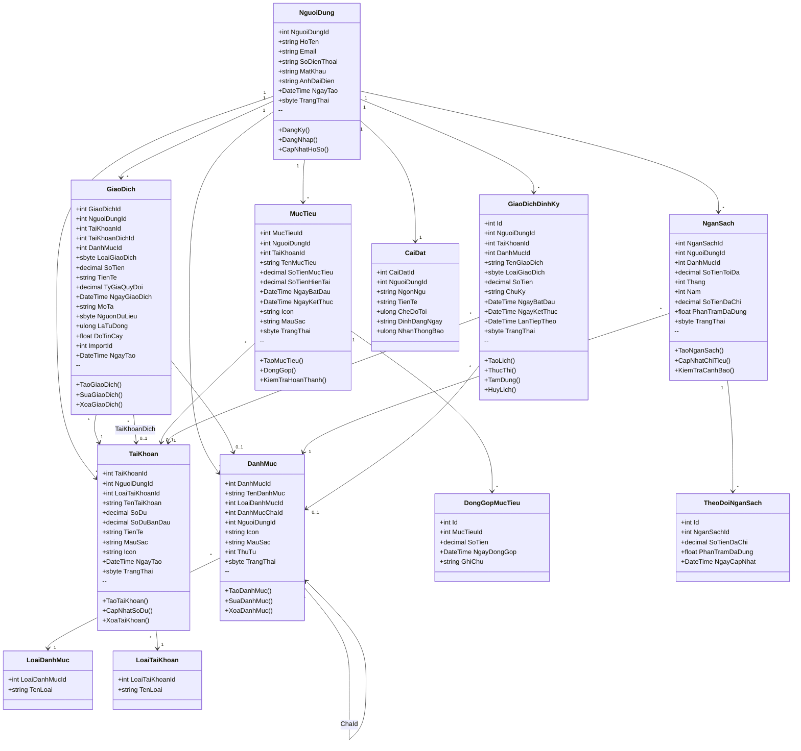
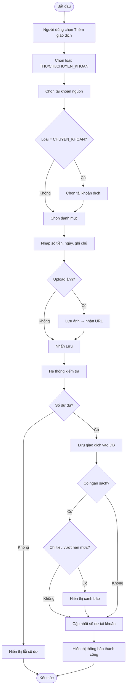
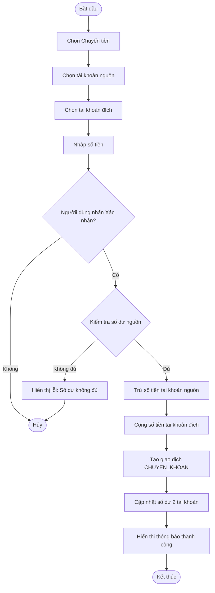
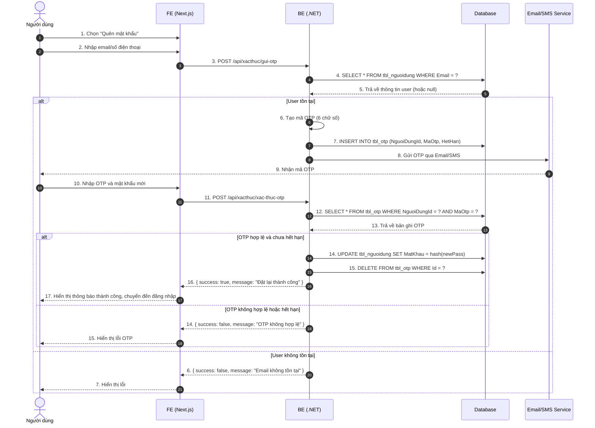
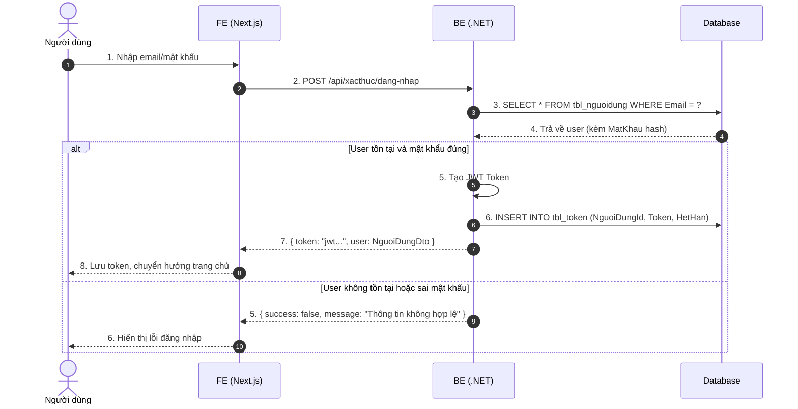
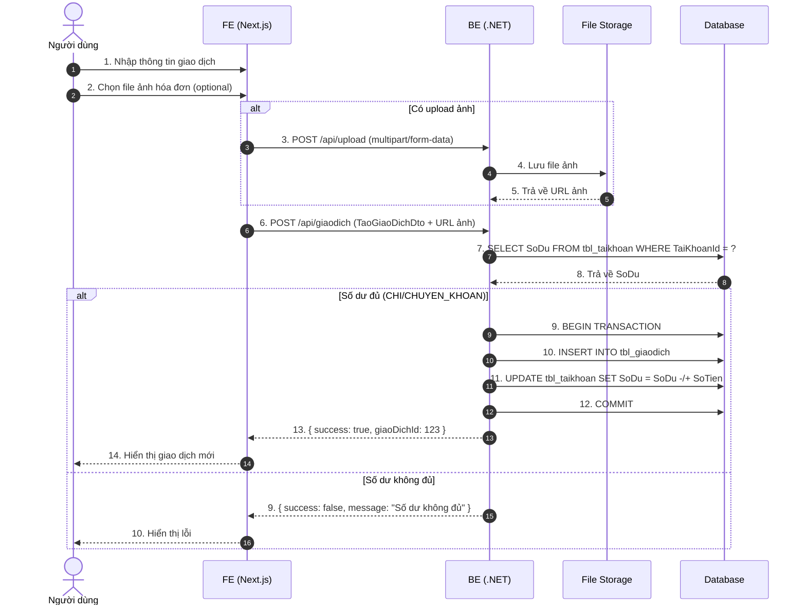
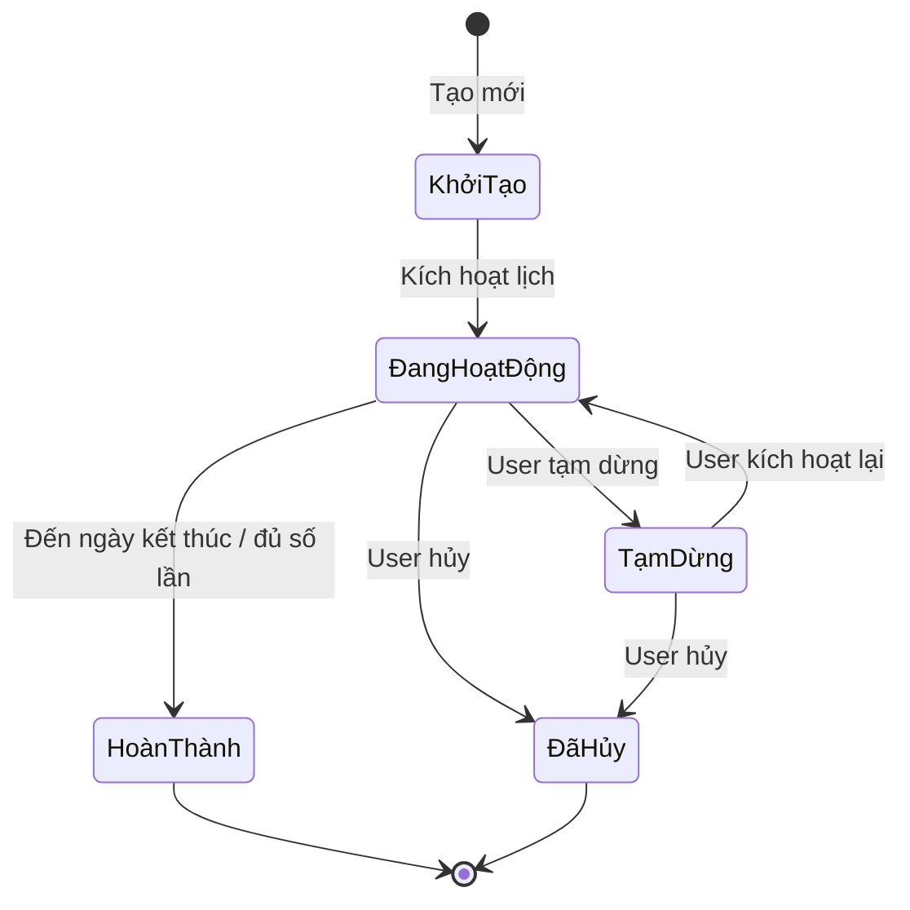
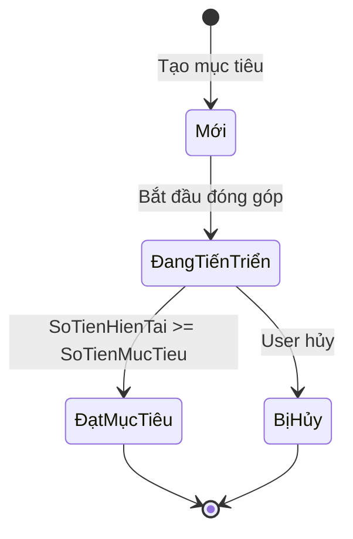
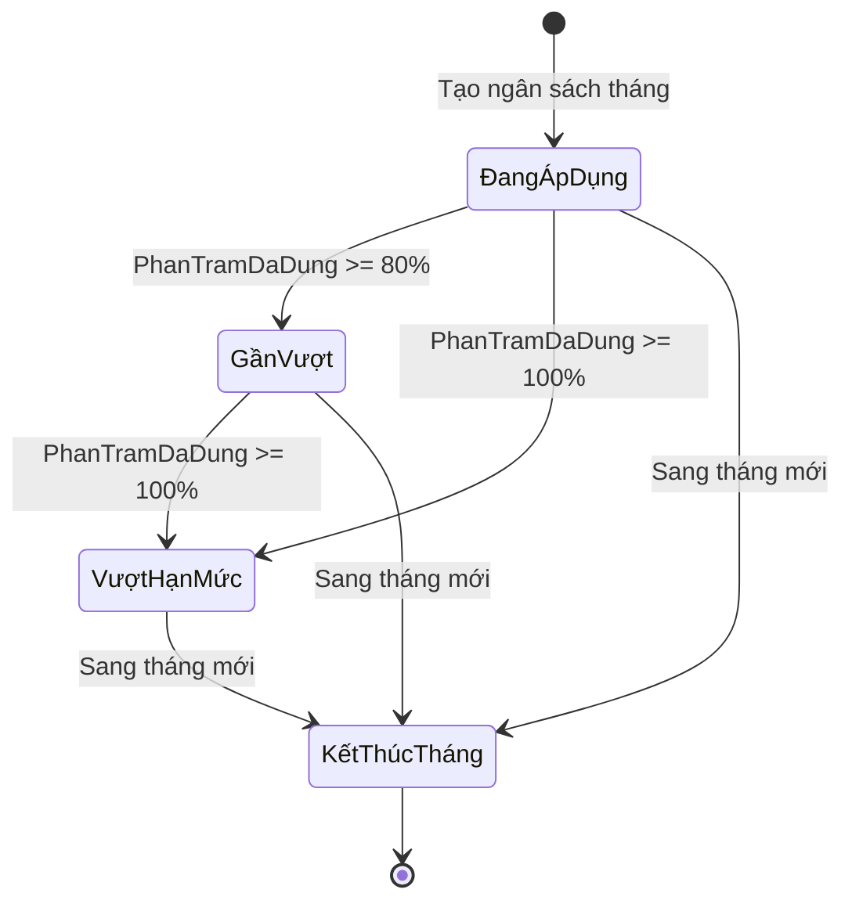

# Cấu trúc Hệ thống Quản lý Tài chính Cá nhân - Phân hệ Người dùng

Tài liệu này mô tả chi tiết các chức năng, biểu đồ và VOPC của phân hệ Người dùng.

---

## 1. Phân hệ Người dùng (User)

Phân hệ User đáp ứng nhu cầu quản lý tài chính cá nhân, gồm các module chính: Trang chủ, Hồ sơ, Bảo mật, Giao dịch, Tài khoản, Danh mục, Ngân sách, Mục tiêu, Báo cáo, Trung tâm AI.

### 1.1. Các chức năng chính của User

- **Đăng ký / Đăng nhập / Đăng xuất**
  + Người dùng có thể đăng ký bằng email, đăng nhập bằng email/mật khẩu hoặc mạng xã hội.
  + Đăng xuất và quản lý phiên đăng nhập.

- **Hồ sơ cá nhân**
  + Xem và cập nhật thông tin cá nhân.
  + Đổi mật khẩu, cập nhật thông tin liên hệ.

- **Bảo mật**
  + Quên mật khẩu, gửi mã OTP qua email/số điện thoại.
  + Đặt lại mật khẩu mới sau khi xác thực.
  + Quản lý trạng thái đăng nhập và các phiên hiện tại.

- **Quản lý Tài khoản**
  + Tạo/sửa/xóa tài khoản tài chính (Ví tiền mặt, Ngân hàng, Ví điện tử, Thẻ tín dụng).
  + Theo dõi số dư và lịch sử biến động.

- **Quản lý Giao dịch**
  + Thêm, sửa, xóa giao dịch thu/chi.
  + Chuyển tiền giữa các tài khoản nội bộ.
  + Tải ảnh hóa đơn, ghi chú và phân loại theo danh mục.
  + Thiết lập giao dịch định kỳ (tự động hoặc nhắc nhở).

- **Quản lý Danh mục**
  + Thêm/sửa/xóa danh mục chi tiêu/thu nhập.
  + Tùy chỉnh icon, màu sắc và thứ tự hiển thị.

- **Thiết lập Ngân sách**
  + Đặt hạn mức chi tiêu hàng tháng cho từng danh mục.
  + Kiểm tra mức sử dụng và cảnh báo khi gần hoặc vượt hạn mức.

- **Mục tiêu Tài chính**
  + Tạo mục tiêu tiết kiệm (ví dụ mua nhà, mua xe, du lịch).
  + Theo dõi tiến độ, trạng thái đóng góp và hoàn thành mục tiêu.

- **Báo cáo & Thống kê**
  + Xem biểu đồ thu/chi, cơ cấu danh mục, so sánh theo tháng.
  + Xem báo cáo tổng quan, dự báo dòng tiền và biến động chi tiêu.

- **Trung tâm AI**
  + Nhận gợi ý và dự báo chi tiêu từ AI Gemini.
  + Chat với trợ lý ảo để hỏi về kế hoạch tài chính.
  + Xem cảnh báo thông minh khi có xu hướng tiêu dùng bất thường.

---

## 2. Use Case Diagram (Biểu đồ Use Case)

```mermaid
useCaseDiagram
    actor "Người dùng" as U
    actor "AI Service" as AI
    
    package "Phân hệ Người dùng" {
        usecase "UC1: Xác thực người dùng" as UC1
        usecase "UC2: Quản lý hồ sơ" as UC2
        usecase "UC3: Quản lý tài chính" as UC3
        usecase "UC4: Lập kế hoạch tài chính" as UC4
        usecase "UC5: Xem báo cáo" as UC5
        usecase "UC6: Tối ưu tài chính" as UC6
        usecase "UC7: Nhận thông báo" as UC7
        usecase "UC8: Nhập xuất dữ liệu" as UC8
    }
    
    U --> UC1
    U --> UC2
    U --> UC3
    U --> UC4
    U --> UC5
    U --> UC6
    U --> UC7
    U --> UC8
    
    AI --> UC6
    AI --> UC5
    
    UC6 ..> UC5 : <<extend>>
    UC7 ..> UC4 : <<extend>>
```

| Use Case | Actor | Mô tả | Chức năng con |
|----------|-------|-------|---------------|
| UC1 | Người dùng | Đăng ký, đăng nhập, đăng xuất, quên mật khẩu/OTP | §2.2 (Xác thực) |
| UC2 | Người dùng | Xem/cập nhật hồ sơ, đổi mật khẩu | §2.3 (Hồ sơ) |
| UC3 | Người dùng | Quản lý tài khoản, giao dịch, danh mục, ngân sách | §2.4-2.7 (Tài chính) |
| UC4 | Người dùng | Lập kế hoạch tài chính (mục tiêu tiết kiệm) | §2.8 (Mục tiêu) |
| UC5 | Người dùng, AI | Xem báo cáo, biểu đồ, thống kê | §2.9 (Báo cáo) |
| UC6 | Người dùng, AI | Tối ưu tài chính (AI Gemini), gợi ý, dự báo | §2.10 (AI) |
| UC7 | Người dùng | Nhận thông báo, cảnh báo ngân sách, nhắc nhở | §2.11 (Thông báo) |
| UC8 | Người dùng | Nhập/xuất dữ liệu (Import/Export CSV/Excel) | §2.12 (Import) |

### 2.2. Use Case Chi tiết - Quản lý Tài khoản

```mermaid
useCaseDiagram
    actor "Người dùng" as U
    package "Quản lý Tài khoản" {
        usecase "UC4.1: Tạo tài khoản" as UC_A1
        usecase "UC4.2: Sửa tài khoản" as UC_A2
        usecase "UC4.3: Xóa tài khoản" as UC_A3
        usecase "UC4.4: Xem số dư" as UC_A4
    }
    U --> UC_A1
    U --> UC_A2
    U --> UC_A3
    U --> UC_A4
```

**UC4.1 Tạo tài khoản:**
- Main Flow: Chọn loại (TIEN_MAT/NGAN_HANG/VI_DIEN_TU/TIET_KIEM) → Nhập tên, số dư ban đầu, mô tả → Chọn icon/màu → Lưu
- Exception: Tên trống, số dư âm

**UC4.2 Sửa tài khoản:**
- Main Flow: Chọn tài khoản → Cập nhật thông tin → Lưu

**UC4.3 Xóa tài khoản:**
- Main Flow: Chọn tài khoản → Xác nhận → Kiểm tra không có giao dịch → Xóa
- Exception: Có giao dịch liên quan

**UC4.4 Xem số dư:**
- Main Flow: Truy cập trang → Hệ thống tổng hợp từ tbl_taikhoan → Hiển thị

### 2.3. Use Case Chi tiết - Quản lý Giao dịch

```mermaid
useCaseDiagram
    actor "Người dùng" as U
    package "Quản lý Giao dịch" {
        usecase "UC5.1: Thêm giao dịch" as UC_T1
        usecase "UC5.2: Sửa giao dịch" as UC_T2
        usecase "UC5.3: Xóa giao dịch" as UC_T3
        usecase "UC5.4: Chuyển tiền" as UC_T4
        usecase "UC5.5: Thiết lập định kỳ" as UC_T5
    }
    U --> UC_T1
    U --> UC_T2
    U --> UC_T3
    U --> UC_T4
    U --> UC_T5
```

**UC5.1 Thêm giao dịch:**
- Main Flow: Chọn loại (THU/CHI/CHUYEN_KHOAN) → Chọn tài khoản nguồn → Chọn danh mục → Nhập số tiền, ngày, ghi chú → Upload ảnh (optional) → Lưu → Cập nhật số dư
- Exception: Số dư không đủ (CHI/CHUYEN_KHOAN)

**UC5.4 Chuyển tiền nội bộ:**
- Main Flow: Chọn nguồn và đích → Nhập số tiền → Kiểm tra số dư → Trừ nguồn → Cộng đích → Tạo giao dịch CHUYEN_KHOAN

**UC5.5 Thiết lập định kỳ:**
- Main Flow: Nhập thông tin → Chọn chu kỳ (HANG_NGAY/TUAN/THANG/NAM) → Chọn ngày bắt đầu/kết thúc → Lưu

### 2.4. Use Case Chi tiết - Quản lý Danh mục

```mermaid
useCaseDiagram
    actor "Người dùng" as U
    package "Quản lý Danh mục" {
        usecase "UC6.1: Tạo danh mục" as UC_D1
        usecase "UC6.2: Sửa danh mục" as UC_D2
        usecase "UC6.3: Xóa danh mục" as UC_D3
    }
    U --> UC_D1
    U --> UC_D2
    U --> UC_D3
```

**UC6.1 Tạo danh mục:**
- Main Flow: Nhập tên → Chọn loại (CHI/THU) → Chọn icon/màu → Chọn cha (optional) → Lưu
- Rule: LaHeThong=true chỉ Admin tạo

**UC6.3 Xóa danh mục:**
- Main Flow: Chọn → Kiểm tra không có giao dịch/ngân sách → Xóa
- Exception: Có giao dịch hoặc là hệ thống

### 2.5. Use Case Chi tiết - Ngân sách

```mermaid
useCaseDiagram
    actor "Người dùng" as U
    package "Ngân sách" {
        usecase "UC7.1: Tạo ngân sách" as UC_B1
        usecase "UC7.2: Sửa ngân sách" as UC_B2
        usecase "UC7.3: Xem cảnh báo" as UC_B3
    }
    U --> UC_B1
    U --> UC_B2
    U --> UC_B3
```

**UC7.1 Tạo ngân sách:**
- Main Flow: Chọn danh mục CHI → Nhập hạn mức → Chọn tháng/năm → Lưu
- Rule: 1 danh mục / 1 tháng / 1 ngân sách

**UC7.3 Xem cảnh báo:**
- Main Flow: Hệ thống tính % từ tbl_theodoi_ngansach → Cảnh báo nếu > 80%

### 2.6. Use Case Chi tiết - Mục tiêu

```mermaid
useCaseDiagram
    actor "Người dùng" as U
    package "Mục tiêu" {
        usecase "UC8.1: Tạo mục tiêu" as UC_M1
        usecase "UC8.2: Đóng góp" as UC_M2
        usecase "UC8.3: Hoàn thành" as UC_M3
    }
    U --> UC_M1
    U --> UC_M2
    U --> UC_M3
```

**UC8.1 Tạo mục tiêu:**
- Main Flow: Nhập tên, số tiền mục tiêu → Chọn ngày bắt đầu/kết thúc → Chọn tài khoản liên kết (opt) → Chọn icon/màu → Lưu

**UC8.2 Đóng góp:**
- Main Flow: Chọn mục tiêu → Nhập số tiền → Ghi chú → Lưu → Cập nhật SoTienHienTai

**UC8.3 Hoàn thành:**
- Trigger: SoTienHienTai >= SoTienMucTieu
- Action: TrangThai=2, gửi thông báo

### 2.7. Use Case Chi tiết - Trung tâm AI

```mermaid
useCaseDiagram
    actor "Người dùng" as U
    actor "Gemini AI" as AI
    package "Trung tâm AI" {
        usecase "UC10.1: Yêu cầu gợi ý" as UC_AI1
        usecase "UC10.2: Chat Gemini" as UC_AI2
        usecase "UC10.3: Cảnh báo thông minh" as UC_AI3
    }
    U --> UC_AI1
    U --> UC_AI2
    U --> UC_AI3
    UC_AI1 --> AI : include
    UC_AI2 --> AI : include
```

---

## 3. Class Diagram (Biểu đồ Lớp)

### 3.1. Sơ đồ tổng quan



### 3.2. Mô tả chi tiết các lớp

#### NguoiDung (tbl_nguoidung)
| Thuộc tính | Kiểu | Ý nghĩa |
|------------|------|---------|
| NguoiDungId | int | PK, tự tăng |
| HoTen | string | Họ tên |
| Email | string | Email đăng nhập (unique) |
| SoDienThoai | string? | SĐT liên hệ |
| MatKhau | string? | Mật khẩu đã hash |
| AnhDaiDien | string? | URL ảnh đại diện |
| NgayTao | DateTime? | Ngày tạo tài khoản |
| TrangThai | sbyte? | 0: Khóa, 1: Hoạt động, 2: Chờ xác thực |

**Phương thức:** DangKy(), DangNhap(), DangXuat(), CapNhatHoSo()

#### TaiKhoan (tbl_taikhoan)
| Thuộc tính | Kiểu | Ý nghĩa |
|------------|------|---------|
| TaiKhoanId | int | PK |
| NguoiDungId | int | FK → NguoiDung |
| LoaiTaiKhoanId | int | FK → LoaiTaiKhoan |
| TenTaiKhoan | string | Tên hiển thị |
| SoDu | decimal? | Số dư hiện tại |
| SoDuBanDau | decimal? | Số dư ban đầu |
| TienTe | string? | VND/USD/EUR |
| MauSac | string? | Mã HEX |
| Icon | string? | Icon/SVG |
| NgayTao | DateTime? | Ngày tạo |
| TrangThai | sbyte? | 0: Đóng, 1: Hoạt động |

**Phương thức:** TaoTaiKhoan(), CapNhatSoDu(), XoaTaiKhoan()

#### GiaoDich (tbl_giaodich)
| Thuộc tính | Kiểu | Ý nghĩa |
|------------|------|---------|
| GiaoDichId | int | PK |
| NguoiDungId | int | FK → NguoiDung |
| TaiKhoanId | int | FK → TaiKhoan (nguồn) |
| TaiKhoanDichId | int? | FK → TaiKhoan (đích) |
| DanhMucId | int? | FK → DanhMuc |
| LoaiGiaoDich | sbyte | 1: THU, 2: CHI, 3: CHUYEN_KHOAN |
| SoTien | decimal | Số tiền |
| TienTe | string? | Loại tiền |
| TyGiaQuyDoi | decimal? | Tỷ giá |
| NgayGiaoDich | DateTime | Ngày giao dịch |
| MoTa | string? | Ghi chú |
| NguonDuLieu | sbyte? | 0: Manual, 1: Import, 2: AI |
| LaTuDong | ulong? | 0: Thủ công, 1: Tự động |
| DoTinCay | float? | % tin cậy AI |
| ImportId | int? | FK → ImportFile |
| NgayTao | DateTime? | Ngày tạo bản ghi |

**Phương thức:** TaoGiaoDich(), SuaGiaoDich(), XoaGiaoDich()

#### DanhMuc (tbl_danhmuc)
| Thuộc tính | Kiểu | Ý nghĩa |
|------------|------|---------|
| DanhMucId | int | PK |
| TenDanhMuc | string | Tên |
| LoaiDanhMucId | int | FK → LoaiDanhMuc |
| DanhMucChaId | int? | FK → DanhMuc (cha) |
| NguoiDungId | int? | FK → NguoiDung (null = hệ thống) |
| Icon | string? | Icon |
| MauSac | string? | Màu HEX |
| ThuTu | int? | Thứ tự hiển thị |
| TrangThai | sbyte? | 0: Ẩn, 1: Hiện |

#### MucTieu (tbl_muctieu)
| Thuộc tính | Kiểu | Ý nghĩa |
|------------|------|---------|
| MucTieuId | int | PK |
| NguoiDungId | int | FK → NguoiDung |
| TaiKhoanId | int? | FK → TaiKhoan (liên kết) |
| TenMucTieu | string | Tên mục tiêu |
| SoTienMucTieu | decimal | Số tiền cần đạt |
| SoTienHienTai | decimal? | Số tiền hiện có |
| NgayBatDau | DateTime? | Ngày bắt đầu |
| NgayKetThuc | DateTime? | Ngày kết thúc |
| Icon | string? | Icon |
| MauSac | string? | Màu |
| TrangThai | sbyte? | 0: Mới, 1: Đang tiến triển, 2: Hoàn thành, 3: Hủy |

#### NganSach (tbl_ngansach)
| Thuộc tính | Kiểu | Ý nghĩa |
|------------|------|---------|
| NganSachId | int | PK |
| NguoiDungId | int | FK → NguoiDung |
| DanhMucId | int | FK → DanhMuc |
| SoTienToiDa | decimal | Hạn mức |
| Thang | int | Tháng (1-12) |
| Nam | int | Năm |
| SoTienDaChi | decimal? | Đã chi |
| PhanTramDaDung | float? | % đã dùng |
| TrangThai | sbyte? | 0: Đóng, 1: Hoạt động |

#### GiaoDichDinhKy (tbl_giaodich_dinhky)
| Thuộc tính | Kiểu | Ý nghĩa |
|------------|------|---------|
| Id | int | PK |
| NguoiDungId | int | FK → NguoiDung |
| TaiKhoanId | int | FK → TaiKhoan |
| DanhMucId | int? | FK → DanhMuc |
| TenGiaoDich | string | Tên |
| LoaiGiaoDich | sbyte | 1: THU, 2: CHI, 3: CHUYEN_KHOAN |
| SoTien | decimal | Số tiền |
| ChuKy | string | HANG_NGAY/TUAN/THANG/NAM |
| NgayBatDau | DateTime | Bắt đầu |
| NgayKetThuc | DateTime? | Kết thúc |
| LanTiepTheo | DateTime? | Lần thực hiện tiếp |
| TrangThai | sbyte? | 0: Khởi tạo, 1: Đang hoạt động, 2: Tạm dừng, 3: Hoàn thành, 4: Đã hủy |

---

## 4. Activity Diagram (Biểu đồ Hoạt động)

### 4.1. Thêm giao dịch mới



**Mô tả chi tiết các bước:**

| Bước | Hành động | Actor | Điều kiện |
|------|-----------|-------|-----------|
| 1 | Chọn "Thêm giao dịch" | User | Đã đăng nhập |
| 2 | Chọn loại giao dịch | User | THU/CHI/CHUYEN_KHOAN |
| 3 | Chọn tài khoản nguồn | User | Tài khoản thuộc User |
| 4 | Chọn tài khoản đích | User | Chỉ khi CHUYEN_KHOAN |
| 5 | Chọn danh mục | User | Theo loại THU/CHI |
| 6 | Nhập số tiền, ngày, ghi chú | User | SoTien > 0 |
| 7 | Upload ảnh hóa đơn (opt) | User | File ảnh |
| 8 | Kiểm tra số dư | System | CHI/CHUYEN_KHOAN cần SoDu >= SoTien |
| 9 | Lưu giao dịch | System | INSERT tbl_giaodich |
| 10 | Kiểm tra ngân sách | System | Nếu CHI thì kiểm tra tbl_ngansach |
| 11 | Cập nhật số dư | System | UPDATE tbl_taikhoan.SoDu |
| 12 | Thông báo kết quả | System | Hiển thị UI |

### 4.2. Chuyển tiền nội bộ



**Mô tả chi tiết các bước:**

| Bước | Hành động | Actor | Điều kiện |
|------|-----------|-------|-----------|
| 1 | Chọn Chuyển tiền | User | Đã đăng nhập |
| 2 | Chọn tài khoản nguồn | User | SoDu > 0 |
| 3 | Chọn tài khoản đích | User | Khác tài khoản nguồn |
| 4 | Nhập số tiền | User | SoTien > 0 |
| 5 | Kiểm tra số dư | System | SoDuNguon >= SoTien |
| 6 | Trừ nguồn | System | UPDATE TaiKhoan.SoDu |
| 7 | Cộng đích | System | UPDATE TaiKhoan.SoDu |
| 8 | Tạo giao dịch | System | INSERT GiaoDich (Loai=CHUYEN_KHOAN) |
| 9 | Thông báo | System | Hiển thị UI |

---

## 5. Sequence Diagram (Biểu đồ Trình tự)

### 5.1. Quy trình quên mật khẩu với OTP



**Mô tả chi tiết luồng tin nhắn:**

| # | Từ | Đến | Tin nhắn | Kiểu | Ghi chú |
|---|-----|-----|----------|------|---------|
| 1 | User | FE | Chọn quên mật khẩu | UI Event | |
| 2 | User | FE | Nhập email/SĐT | Input | |
| 3 | FE | BE | POST /api/xacthuc/gui-otp | HTTP Request | YeuCauGuiOtpDto |
| 4 | BE | DB | SELECT user | SQL | Kiểm tra tồn tại |
| 5 | DB | BE | User data | SQL Result | |
| 6 | BE | BE | Generate OTP | Internal | Random 6 digits |
| 7 | BE | DB | INSERT otp | SQL | Lưu OTP, thời hạn 5 phút |
| 8 | BE | ES | Send OTP | SMTP/SMS | |
| 9 | ES | User | OTP Code | Email/SMS | |
| 10 | User | FE | Nhập OTP + pass mới | Input | |
| 11 | FE | BE | POST /api/xacthuc/xac-thuc-otp | HTTP Request | YeuCauXacThucOtpDto |
| 12 | BE | DB | SELECT otp | SQL | Kiểm tra OTP |
| 13 | DB | BE | OTP record | SQL Result | |
| 14 | BE | DB | UPDATE password | SQL | Hash mật khẩu mới |
| 15 | BE | DB | DELETE otp | SQL | Xóa OTP đã dùng |
| 16 | BE | FE | JSON response | HTTP Response | PhanHoiXacThucOtpDto |
| 17 | FE | User | UI notification | UI Update | |

### 5.2. Đăng nhập



### 5.3. Tạo giao dịch mới



---

## 6. State Machine Diagram (Biểu đồ Trạng thái)

### 6.1. Trạng thái Giao dịch định kỳ



**Mô tả chi tiết các trạng thái:**

| Trạng thái | Mô tả | Sự kiện chuyển tiếp |
|------------|-------|---------------------|
| KhởiTạo | Vừa tạo, chưa kích hoạt | Kích hoạt lịch |
| ĐangHoạtĐộng | Đang thực hiện định kỳ | Tạm dừng / Hủy / Hoàn thành |
| TạmDừng | Tạm dừng thực hiện | Kích hoạt lại / Hủy |
| HoànThành | Đến ngày kết thúc hoặc đủ số lần | Kết thúc vòng đời |
| ĐãHủy | User chủ động hủy | Kết thúc vòng đời |

### 6.2. Trạng thái Mục tiêu tài chính



### 6.3. Trạng thái Ngân sách



---

## 7. VOPC (Value Object, Participant, Container)

### 7.1. VOPC cho UC1: Đăng ký/Đăng nhập

| Thành phần | Chi tiết |
|------------|----------|
| **Actor** | Người dùng (chưa đăng nhập) |
| **Pre-condition** | Có kết nối internet, chưa có phiên đăng nhập |
| **Post-condition** | Được cấp JWT token, chuyển hướng vào hệ thống |
| **Value Objects** | YeuCauDangKyDto, YeuCauDangNhapDto, PhanHoiDangKyDto, PhanHoiDangNhapDto |
| **Participants** | XacThucController, XacThucBll, NguoiDungDal, DichVuJwt |
| **Container** | API_ND (Authentication API) |
| **Main Flow** | 1. User nhập email/mật khẩu → 2. FE gửi đến BE → 3. BE kiểm tra DB → 4. Tạo JWT → 5. Trả token → 6. FE lưu và chuyển hướng |
| **Alt Flow** | Đăng nhập bằng OAuth (Google/Facebook) qua YeuCauDangNhapMangXaHoiDto |
| **Exception** | Email không tồn tại, mật khẩu sai, tài khoản bị khóa (TrangThai=0) |
| **Business Rules** | Email phải unique và đúng định dạng, mật khẩu >= 8 ký tự |
| **NFR** | Thời gian phản hồi < 2s, mã hóa SSL, lưu mật khẩu dạng hash |

### 7.2. VOPC cho UC3: Quên mật khẩu / OTP

| Thành phần | Chi tiết |
|------------|----------|
| **Actor** | Người dùng |
| **Pre-condition** | Tài khoản tồn tại trong hệ thống |
| **Post-condition** | Mật khẩu được đặt lại thành công |
| **Value Objects** | YeuCauGuiOtpDto, YeuCauXacThucOtpDto, YeuCauDatLaiMatKhauDto, PhanHoiGuiOtpDto, PhanHoiXacThucOtpDto, PhanHoiDatLaiMatKhauDto |
| **Participants** | XacThucController, XacThucBll, OtpDal, EmailService, NguoiDungDal |
| **Container** | API_ND |
| **Main Flow** | 1. Nhập email → 2. BE kiểm tra user → 3. Tạo OTP → 4. Lưu OTP (5 phút) → 5. Gửi email → 6. User nhập OTP + pass mới → 7. Xác thực OTP → 8. Cập nhật mật khẩu → 9. Xóa OTP |
| **Alt Flow** | Gửi lại OTP (giới hạn 3 lần/phút) |
| **Exception** | OTP sai, OTP hết hạn, email không tồn tại |
| **Business Rules** | OTP 6 chữ số, hết hạn sau 5 phút, không lưu OTP vĩnh viễn |
| **NFR** | Bảo mật cao, rate limiting gửi OTP |

### 7.3. VOPC cho UC5: Quản lý giao dịch

| Thành phần | Chi tiết |
|------------|----------|
| **Actor** | Người dùng đã đăng nhập |
| **Pre-condition** | Có ít nhất 1 tài khoản |
| **Post-condition** | Giao dịch được tạo/sửa/xóa, số dư được cập nhật |
| **Value Objects** | GiaoDichDto, TaoGiaoDichDto, LocGiaoDichDto |
| **Participants** | GiaoDichController, GiaoDichBll, GiaoDichDal, TaiKhoanDal |
| **Container** | API_ND |
| **Main Flow** | 1. Nhập thông tin → 2. Upload ảnh (opt) → 3. Kiểm tra số dư → 4. BEGIN TRAN → 5. INSERT giao dịch → 6. UPDATE số dư → 7. COMMIT → 8. Trả kết quả |
| **Alt Flow** | Chuyển khoản (cần 2 tài khoản), giao dịch định kỳ |
| **Exception** | Số dư không đủ, tài khoản không tồn tại, danh mục không hợp lệ |
| **Business Rules** | CHI/CHUYEN_KHOAN phải có SoDu >= SoTien, ngày giao dịch không được tương lai |
| **NFR** | Transaction ACID, phản hồi < 1s |

### 7.4. VOPC cho UC7: Thiết lập ngân sách

| Thành phần | Chi tiết |
|------------|----------|
| **Actor** | Người dùng đã đăng nhập |
| **Pre-condition** | Có danh mục CHI |
| **Post-condition** | Ngân sách được tạo, theo dõi được kích hoạt |
| **Value Objects** | NganSachDto, ThietLapNganSachDto |
| **Participants** | NganSachController, NganSachBll, NganSachDal, TheoDoiNganSachDal |
| **Container** | API_ND |
| **Main Flow** | 1. Chọn danh mục → 2. Nhập hạn mức → 3. Chọn tháng/năm → 4. INSERT tbl_ngansach → 5. Tạo bản ghi tbl_theodoi_ngansach → 6. Trả kết quả |
| **Exception** | Danh mục đã có ngân sách trong tháng, hạn mức <= 0 |
| **Business Rules** | 1 danh mục / 1 tháng / 1 ngân sách, tự động tính % khi có giao dịch CHI |

### 7.5. VOPC cho UC8: Quản lý mục tiêu

| Thành phần | Chi tiết |
|------------|----------|
| **Actor** | Người dùng đã đăng nhập |
| **Pre-condition** | - |
| **Post-condition** | Mục tiêu được tạo, tiến độ được cập nhật |
| **Value Objects** | MucTieuDto, TaoMucTieuDto, DongGopMucTieuDto, TaoDongGopMucTieuDto |
| **Participants** | MucTieuController, MucTieuBll, MucTieuDal, DongGopMucTieuDal, TaiKhoanDal |
| **Container** | API_ND |
| **Main Flow** | 1. Tạo mục tiêu → 2. Đóng góp → 3. INSERT tbl_donggop_muctieu → 4. UPDATE tbl_muctieu.SoTienHienTai → 5. Kiểm tra hoàn thành |
| **Exception** | Số tiền đóng góp <= 0, mục tiêu đã hoàn thành/hủy |
| **Business Rules** | Tự động chuyển trạng thái Hoàn thành khi SoTienHienTai >= SoTienMucTieu |

### 7.6. VOPC cho UC10: Trung tâm AI

| Thành phần | Chi tiết |
|------------|----------|
| **Actor** | Người dùng đã đăng nhập, Gemini AI |
| **Pre-condition** | Có lịch sử giao dịch để phân tích |
| **Post-condition** | Nhận được gợi ý/dự báo từ AI |
| **Value Objects** | DuDoanAIChartDto, LoiKhuyenAIDto, CanhBaoHeThongDto, TroLyAIType |
| **Participants** | AiController, AiBll, GeminiService, AiDal |
| **Container** | API_ND |
| **Main Flow** | 1. User gửi yêu cầu → 2. BE lấy lịch sử giao dịch → 3. Gọi Gemini API → 4. Nhận phản hồi → 5. Lưu gợi ý → 6. Trả về FE |
| **Exception** | Gemini API lỗi, không có dữ liệu đủ để phân tích |
| **NFR** | Phản hồi AI < 5s, cache kết quả 1 giờ |

---

## 8. Tổng kết các quan hệ chính

| Quan hệ | Lớp nguồn | Lớp đích | Loại | Mô tả |
|---------|-----------|----------|------|-------|
| 1-n | NguoiDung | TaiKhoan | Composition | User sở hữu nhiều tài khoản |
| 1-n | NguoiDung | GiaoDich | Composition | User tạo nhiều giao dịch |
| 1-n | NguoiDung | DanhMuc | Composition | User tạo nhiều danh mục |
| 1-n | NguoiDung | MucTieu | Composition | User đặt nhiều mục tiêu |
| 1-n | NguoiDung | NganSach | Composition | User lập nhiều ngân sách |
| 1-1 | NguoiDung | CaiDat | Aggregation | User có 1 bộ cài đặt |
| 1-n | TaiKhoan | GiaoDich | Association | Tài khoản có nhiều giao dịch |
| 0..1-n | TaiKhoan | GiaoDich | Association | Tài khoản đích (chuyển khoản) |
| 1-n | LoaiTaiKhoan | TaiKhoan | Association | Phân loại tài khoản |
| 1-n | DanhMuc | GiaoDich | Association | Danh mục phân loại giao dịch |
| 1-n | LoaiDanhMuc | DanhMuc | Association | Phân loại danh mục |
| 1-n | DanhMuc | DanhMuc | Self-association | Danh mục cha - con |
| 0..1-n | TaiKhoan | MucTieu | Association | Mục tiêu liên kết tài khoản |
| 1-n | MucTieu | DongGopMucTieu | Composition | Mục tiêu có nhiều đóng góp |
| 1-n | DanhMuc | NganSach | Association | Ngân sách cho danh mục |
| 1-n | NganSach | TheoDoiNganSach | Composition | Theo dõi chi tiêu ngân sách |
| 1-n | TaiKhoan | GiaoDichDinhKy | Association | Lịch định kỳ từ tài khoản |

---

*Lưu ý: Tài liệu này được xây dựng dựa trên mã nguồn thực tế của hệ thống (BE: .NET 3-layer, FE: Next.js) và có thể sử dụng để vẽ trực tiếp trên Visual Paradigm.*

